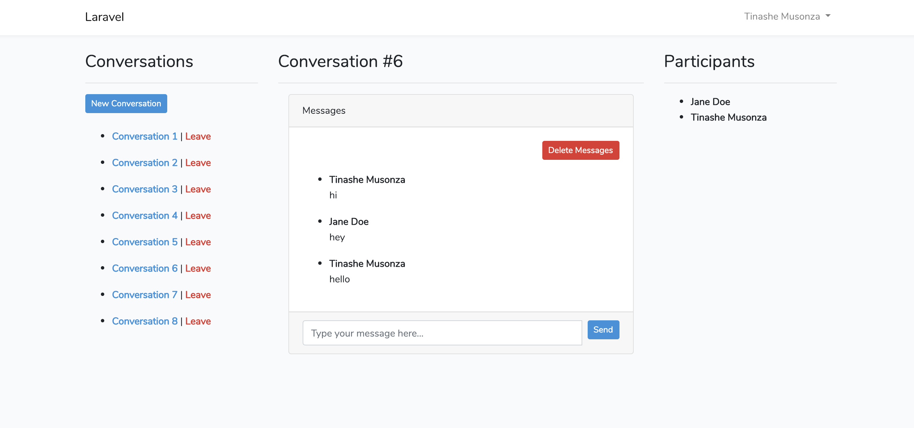

# chat-demo

This is a simple demo application for https://github.com/musonza/chat/

1. Clone this repo
2. `composer install`
3. `cp .env.example .env`
4. `php artisan migrate`
5. `php artisan key:generate`
6. Create 2 user accounts in different browsers and start chatting
